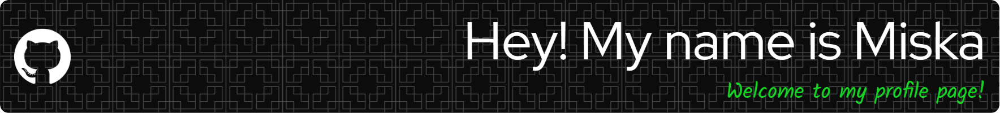

<!-- improved GitHub README starts here -->

 
  

---

### 👨‍🎓 **About Me**

- 📚 Currently pursuing bachelors degree from **Business Information Technology** at Laurea University.
- 💼 Nearly 7 years at **Swissport Finland Oy**, developing strong soft skills like teamwork, communication, adaptability, and stress management.
- 💻 Passionate about **front-end web development**, with projects ranging from static websites to more complex movie applications utilizing external APIs.
- 🎨 Focused on creating clean, responsive, and user-friendly interfaces that prioritize both **design and functionality**.

---

## 🔧 **Technologies & Tools**

### **Languages & Frameworks**

  
  
  
  
  

### **Databases**

  

### **UI/UX Tools**

  
  
  

### **Development Tools**

  
  
  
  

### **Operating Systems**

  
  
  

---

## 🌱 **What I'm Learning**

I'm constantly improving my skills and learning new technologies. Currently, I'm focused on:

- 🔧 Building full-stack applications with **React** and **Node.js**
- 🗄️ Deepening my knowledge of **MongoDB** for database management
- 🎨 Exploring **UI/UX design** to create intuitive and user-friendly interfaces
- 🌐 Building webpages with **WordPress**

---

## 🚀 **My Future Goals**

- 🎓 Complete my degree and continue expanding my knowledge in **Front-End Development and UI/UX Design**.
- 💼 Land an internship that allows me to further hone my skills in the field of IT.
- 🤖 Learn more about **AI** and how it changes the daily work life of front-end developers and UI/UX designers.

---

## 🛠️ **My Debugging Process**

1. 😱 Panic.
2. 💻 Blame the computer.
3. 🤨 Blame JavaScript.
4. 🔍 Google it.
5. 🎉 Fix it.
6. 😎 Take full credit.

---

## 📫 **Want to send me a message? Let's Connect!**

  
  

<!-- improved GitHub README ends here -->
